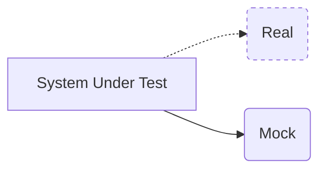

# What is mocking?

---
hideInToc: true
---

## A type of test double

---
layout: quote
hideInToc: true
---

# Definition

"Mocks are pre-programmed with expectations which form a specification of the calls they are expected to receive. They can throw an exception if they receive a call they don't expect and are checked during verification to ensure they got all the calls they were expecting."

Martin Fowler

