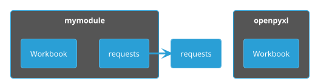

# Python mocking

---
hideInToc: true
---

# Import and Namespace

<div class="grid grid-cols-2 gap-x-4 pt-6">

<v-clicks :every='2'>

- individual import

```python
from openpyxl import Workbook
```

</v-clicks>

<v-clicks :every='2'>

- module import

```python
import requests
```

</v-clicks>

</div>

<div v-click class="flex justify-center pt-14">



</div>
